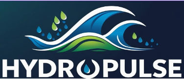

## Investigating Approaches for Representing Pluvial Flooding within NOAA’s NextGen Modeling Framework

<p align="left">
  
</p>


This repository supports a study evaluating the spatial reliability and predictive accuracy of the NextGen National Water Model for localized pluvial flooding. It includes tools for processing storm event data, computing pluvial flood indices (PFIs), and visualizing flood responses across diverse catchment sizes and urban land covers. The workflow helps benchmark NextGen’s applicability for site-specific flood detection and urban hydrology analysis.

### Methodological approach
In this study, we adopted the methodological framework represented in below Figure. We develop an operational framework that integrates the local storm reports, insurance data for isolating pluvial flood events, runs the NextGen Conceptual Functional Equivalent (CFE) model for the selected events, and determines the pluvial events based on the indices developed. The following subsections describe the data preparation and determination of the pluvial indices in detail.

<p align="center">
  
</p>

### Code
#### Clone the Repository

```bash
git clone https://github.com/NWC-CUAHSI-Summer-Institute/hydropulse
cd hydropulse
```

#### Create a virtual environment
 ``` bash
python -m venv venv
source venv/bin/activate   # macOS/Linux
venv\Scripts\activate      # Windows
```

#### Install Dependencies
```bash
pip install -r requirements.txt
```

#### Dataset
All the dataset used in this study is available in this Hydroshare link: https://www.hydroshare.org/resource/a20de1de8cdf4c5197f46319cb911242/

### For More Information
For more information, do contact team Hydropulse- Supath Dhital (sdhital@crimson.ua.edu), Yogesh Bhattarai (yogesh.bhattarai@bison.howard.edu) and Samrin Sauda (sss6318@psu.edu)